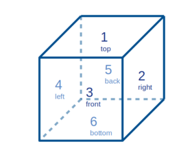

# Montecarlo simulation of neutrons impinging on a plastic scintillator (polyvinyl toluene).

The aim of this simulation was to underline the behaviour of neutrons on a plastic scintillator.
Different geometrical and energetic configuration has been made. 
The purpose of this simulation was to see whether it was possible to extimate the number of double scattering that happen on the scintillator.

### The aim of this simulation
The aim of the experiment for which this simulation was built is to define direction vector of inpinging neutrons by exploiting the light emitted by scattered protons inside the scintillator. 

In order to do so, it was necessary to understand the amount of neutrons that were able to do double elastic scattering inside the scintillator. This montecarlo simulation was developed for this purpose.


After each scattering, the neutron loses a certain amount of energy and changes its direction of a scattering angle that is related with the amount of energy lost. 

The simulation follow the path of the neutron and, for each step, untill it exit form the scintillator or its energy decreases below a certain threshold (which has been choosen of 1 MeV, comparable with detector resolution). 

The information regarding the the neutron path.
The program writes the informations regarding the single steps and the full event in two different files: 
 
- **step.txt**: in which there are informations regarding the position of the interaction, the energy of the neutron and the type of interaction. 

	*event, step, position (x,y,z),type of interaction and energy of the neutron after the interaction (in MeV) *

 
- **event.txt**: in which information about the final event are saved. The file keep sign of 

	*event number, total number of steps for the single event, final position of the neutron* 


### Installation
To install the application, the user has to clone [this repository](https://github.com/claudiapisanti/Montecarlo-simulation-of-neutrons.git).
Then requirements can be installed by using pip:

```
	git clone https://github.com/claudiapisanti/Montecarlo-simulation-of-neutrons.git
	cd Montecarlo-simulation-of-neutrons/
	git checkout master
	pip install -r requirements.txt
```

The file requirements.txt already comprehends all the required packages and specifies also the necessary versions to run the program. They are not specific packages, so probably they will already be installed on your pc.
[//]: <> (questo lo metto???) 


## Usage

When installed, the program can be run from command line.
The python version used in this project is python3.

```
	python3 montecarlo.py
```

In this way the program will automatically read as a macro file the file 'example.txt'.
It is also possible to compile the program with a different macro file (eg. 'macro_file.txt') by writing the name fo the file after montecarlo.py:

```
	python3 montecarlo.py macro_file.txt
```
For more information on how to write the macro_file see *Physical characteristics* paragraph.

The program will work in multiprocessing and it will automatically count the number of CPU available. 


## Physical characteristics
The user can interact with the program via a txt file where it is possible to change different parameters of the simulation: 

- number of particles,

- scintillator dimensions

- type of energy distribution of source particles

- geometrical distribution of the source

It consists of a 7 line txt file in which several parameters of the simulation can be changed.

**NB:** it is strictly necessary that the file line are written in the correct order and that nothing is written before the first line. Even a void line or a space will be considered as a line and the program would not work properly.

**NB:** each value inserted must be follower by a space ' ', otherwise the programm will not run properly. After this space, it is possible to write anything: it will not be read by the program.

It is possible to write anything after the sixth line: it will not be read by the program.

*physical_characteristics.txt* must be compiled as following:

1. Line 1. --> seed for random number generator

	In order to get random numers, a constant value (+1) is added for each process. (eg. if the chosen seed is 42 and we are working with 4 processes, the seed for each process will be respectively 42,43,44 and 45). In this way replicability and randomity are both preserved.

2. Line 2. --> number of particles

3. Line 3. --> Energy distribution. Type **MONO** for monoenergetic source and **UNIF** for uniformly distributed source.

4. Line 4. --> Energy value. 

	- if line 3 is MONO, type a single value of energy for the particle source
	- if line 3 is UNIF, type two value that will be the energy range in which the particles will be produced in an uniform distribution. Energy is in MeV

	*example 1:* monoenergetic source. All initial neutrons will be produced with an enegy equal to 1 MeV.

	```
	MONO # line 3 energy distribution
	1 #line 4 energy value
	```

	*example 2:* uniformly distributd source. All initial neutrons energy will be in a range between Emin = 1 MeV and Emax = 10 MeV

	```
	UNIF # line 3 energy distribution
	1 10 # line 4 energy range
	```
5. Line 5. --> Scintillator dimensions. Dimension of the scintillator must be typed in cm. For each direction (x,y,z) the lenght of the parallelepiped must be given followed by a space. 

	*example:* cubic scintillator of 6 cm side.

	```
	6 6 6 # line 5 scintillator dimension
	```

6. Line 6. --> Geometrical distribution of the source. Type **PUNT** fro pointlike source, **EST** for extended source and **SPH** for spherical source

	- **PUNT:**  it is a point like source: all the particles will be produced from a single point. The position of the source can be determined by the user (see line 7).
	- **EST:** in this case the particles are generated on the external surface of the scintillator on all the six faces. It is possible to give to the faces different weights in order to determine a more probable direction of the source(see line 7) (a possible application of this is the simulation of cosmic rays that come from all around the space but they mostly came from above).

	- **SPH:** in this case the particles are isotropically generated on a sphere. The centre of the sphere will be always the centre of the scintillator and the radius can be choosen (see line 7).


7. Line 7. --> Other parameters for the geometric distribution of the source.
	
	- if line 5 is PUNT, type the position of the source in (x,y,z) format. As for line 5, all the three coordinates must be followed by a space.

	*example 1:* point source in pos x = 0, y = 0, z = 6 cm.

	```
	PUNT # line 6 spatial distribution
	0 0 6 # line 7 point source coordinates
	```

	- if line 6 is EST, type the probability of having a certain distribution. For the legend of faces numbers see the picture below.

		**NB:** the program already normalize the probability distribution, so it will not be necessary that the sum of the probabilities of all the six faces is equal to 1. 

	*example 2:* extended source with higher probability of particles coming from the top of the scintillator. In this case the majority of the neutrons comes form the top of the scintillator (face 1).

	```
	EST # line 5 spatial distribution
	100 2 3 4 5 6 # line 6 probability of generating the sorce in a specific face
	```

	- if line 6 is SPH, type the radius of the sphere.

	*example 3:* spherical source of radius 6 cm.

	```
	SPH # line 6 spatial distribution
	6 # line 7 radius in cm
	```

Here a sketch ot the legend of the faces numbers.




Once intalled, an example macro can be found as 'example.txt'.

### CROSS SECTIONS

The cross section used in this program has been taken form the site [JANIS](https://www.oecd-nea.org/janisweb/).

In this site all all the cross section in function of the energy are provided for each atom. The total cross section of polyvinyl toluene (C9H10) is obtained as the combination of Carbon and Hydrogen cross sections. In the directory 'cross_sections' it has been provided the txt file with the cross section used in the program ('cs.txt') and the cross sections of neutron-proton scattering and neutron-carbon scattering taken form JANIS site. 
The file 'cs_calculator.py' has been also provided for completness. Anyway, it is not necessary to run the file: 'cs.txt' is already ready for the first run.


## Testing
All tests for the program are written in the file *test.py*. To run from the command line: 
```
pytest tests.py
```

## An Example
As written in paragraph *Usage*, an example of the simulation of the program can be run by simply compiling the following code:

```
	python3 montecarlo.py
```

The program will run using the macro written in the file *example.txt*.

In the file a small simulation of 1000 neutrons is simulated.
The source is monoenergetic (at 5 MeV) and it is pointlike situated at the point (x,y,z) = (3,0,3).
The scintillator is a cube of 6 cm side.


